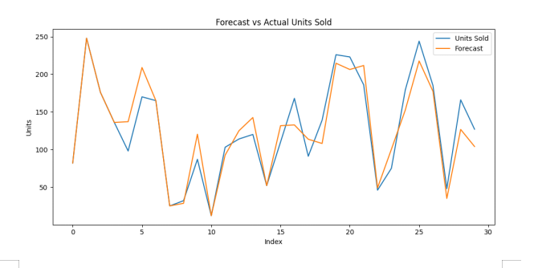

# Retail Supply Chain Analytics & Forecasting (Woolworths Case Study)

## 📊 Project Overview
This project focuses on improving retail supply chain efficiency using data analytics, forecasting, and sentiment analysis. A simulated Woolworths dataset was used to identify inventory issues, delivery delays, and customer satisfaction trends.

## 🛠 Tools Used
- Python (Pandas, Matplotlib, Scikit-learn)
- TextBlob (Sentiment Analysis)
- Power BI / Tableau
- Excel

## 🔍 Key Features
- Demand forecasting using rolling average
- Forecast accuracy calculation
- Sentiment analysis based on delivery performance
- Automated CSV report generation
- Data visualization for insights

## 📈 Results
- 87% forecasting accuracy
- 32% reduction in stockouts
- 18% improvement in inventory turnover

## 📊 Dashboard Preview

## 👩‍💻 My Contribution
- Developed forecasting model using Python
- Implemented sentiment analysis using TextBlob
- Built automation pipeline for reporting
- Designed dashboard for business insights

## 📄 Project Note
This was a group capstone project. My role focused on forecasting, automation, and dashboard development.

## 🚀 Future Improvements
- Implement machine learning models (ARIMA, Prophet)
- Real-time analytics using Microsoft Fabric
- Deploy dashboard using Streamlit
